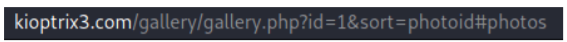
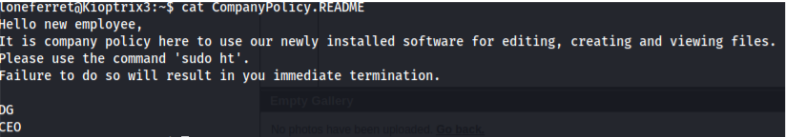

---
# Kioptrix Level 3 - Vulnhub VM Challenge

## Description
As with the other two, this challenge is geared towards the beginner. It is however different. Added a few more steps and a new skill set is required. Still being the realm of the beginner I must add. The same as the others, there’s more then one way to “pwn” this one. There’s easy and not so easy. Remember… the sense of “easy” or “difficult” is always relative to ones own skill level. I never said these things were exceptionally hard or difficult, but we all need to start somewhere. And let me tell you, making these vulnerable VMs is not as easy as it looks…<br>
**Important** thing with this challenge. Once you find the IP (DHCP Client) edit your hosts file and point it to kioptrix3.com <br>
Under Linux that would be **/etc/hosts**
There’s a web application involved, so to have everything nice and properly displayed you really need to this
<br>

## Setting up the environment
The readme file for the Virtual machine contained the following: 
Before playing the game, please modify your attacker's hosts file. 
<ip> kioptrix3.com 
So we have to modify the hosts file in the directory 
**/etc/hosts** and add the ip 

## Finding the IP of the Target Machine

The IP of the target machine is found by using [Netdiscover tool](https://github.com/alexxy/netdiscover).

Here I got the IP of the vulnerable machine as **192.168.1.119**

## Initial Scan 

First, [Nmap scanner](https://github.com/nmap/nmap) is used to find all the open ports and services running. 
After the nmap scan we can see that only 2 ports are open **(22 and 80)** 

It's time to do some more recon. 

[Nikto Web scanner](https://github.com/sullo/nikto) is used here to scan for any possible server side vulnerabilities and information. This scan shows that there is a **phpmyadmin** directory. By this we can assume that the site is connected to a database. 


## SQL Injection

When we navigate to the website hosted by the machine, we get a blog page. 


When we click **now** it moves to a gallery page


Here when we go to the sorting options and select sort by id, the url was:



Now to check whether there is a SQL Injection vulnerability, I referred a page which helped me in SQL Injection => 
[http://breakthesecurity.cysecurity.org/2010/12/hacking-website-using-sql-injection-step-by-step-guide.html](http://breakthesecurity.cysecurity.org/2010/12/hacking-website-using-sql-injection-step-by-step-guide.html) <br>
So we can confirm that there is a SQL Injection vulnerability by modifying the url and adding **‘ after the id=1** which throws an error


Now we find the number of columns in the table by adding **order by n --** (n=1,2,3 ….) till we get an error in the page. Here we get an error when n = 7 so the number of columns = 6.
Then we display the vulnerable columns by adding **-1 union select 1,2,3,4,5,6--**


Here 2 and 3 are the vulnerable columns which get executed and displayed. So now we can add some functions like **version(), database(), user()** in their place to check whether they are executed and can get displayed. Then we try to display the table names 


Here we can assume that **dev_accounts** might contain some useful information. Then we try to find the column names and for that the table name dev_accounts must be converted to MySql **CHAR()** string in order to execute the query


Here we found that there are 2 useful columns i.e username and password Now after modifying the query we can get the **username** and **password** 


Then by using hashcat we can know about the hash type as **MD5** and we can just use an online decrypter to decrypt the hash.


## Privilege Escalation

After finding the passwords we can login **SSH** using these credentials. Now we have to escalate our privileges to root. <br>
When we list the directory,


And when we check the **CompanyPolicy.README** file,



We use the command below to modify the [sudoers](https://www.linux.com/training-tutorials/configuring-linux-sudoers-file/) file

```bash
sudo ht /etc/sudoers
```
Now we can escalate our privileges to root by adding **/bin/sh** to the privilege specification part


And finally we get root access by the command below
```bash
sudo /bin/sh
```
As we have added that to the sudoers file, this above command will work.


Finally we got root access <3