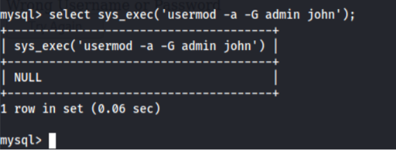

---
# Kioptrix Level 4 - Vulnhub VM Challenge

## Description
This Kioptrix VM Image are easy-medium level challenges. The object of the game is to acquire root access via any means possible (except actually hacking the VM server or player). The purpose of these games are to learn the basic tools and techniques in vulnerability assessment and exploitation. There are more ways then one to successfully complete the challenges.
<br>


## Finding the IP of the Target Machine

The IP of the target machine is found by using [Netdiscover tool](https://github.com/alexxy/netdiscover).

Here I got the IP of the vulnerable machine as **192.168.1.158**

## Initial Scan 

First, [Nmap scanner](https://github.com/nmap/nmap) is used to find all the open ports and services running. 


Here we can find that Apache server is running on port 80 which can be used for exploitation
purposes and NetBIOS is open on 139 and 445 in which we can enumerate SMB for more
information such as usernames. <br>
So for **SMB enumeration**, we can use nmap with SMB scripts:

```bash
nmap --script=smb-enum-users <ip>
```


After this scan, we got 5 usernames

## SQL Injection

When we navigate to the website hosted, we get a login page


If we try using **‘** as the username and password, we get an error indicating that this page is
**vulnerable** to SQL Injection


Now if we check for SQL Injection vulnerability by entering **'or '1'='1** in both the input fields,
we get an error related to the username


Here we can see that the username is **escaped** to avoid the SQL Injection vulnerability.
When we try with the username john where we found the SMB enumeration (password remained the same), it worked!


It shows the password for john.

## Escaping Restricted Shell

As we saw in the nmap result, there was an SSH connection. Now we can try to do a SSH
login using the username and password we got.


Here the usage of commands we can use is limited. From this we can assume that we are in
a **Restricted shell**. To know more about restricted shell, refer
https://www.sans.org/blog/escaping-restricted-linux-shells/

Assuming that python was already installed in Ubuntu, we can invoke **/bin/sh** shell using:

```bash
echo os.system('/bin/sh')
```


Now we have escaped from the restricted shell!

## Privilege Escalation

As we have more access now we can check the processes running with root privilages

```bash
ps -ef | grep root
```


Here we can find that MySQL is running as root.
Now we move to the dir **/var/www**
to see the file **checklogin.php** which was mentioned when we tried SQL Injection


This reveals that the root credentials for MySQL is null.
Now as we have root access to MySQL, we can try to escalate the privileges by **Command
execution using MySQL User Defined Function**.

Now for doing this, we have to check whether MySQL has a module **UDF** for running the
**sys_exec** function which will be used for the privilege escalation exploit.
So when we try to locate it,


There is a module installed in **/usr/lib/lib_mysqludf_sys.so** which indicates that we can
proceed with the escalation. <br>
After that we try to login MySQL with the root credentials


After logging in, we can use the command below to
add john in the admin group

```sql
select sys_exec('usermod -a -G admin john');
```


Now that we executed the command, we can get root access by running the command
**sudo su** and inputting the password which we found for john


Finally, root access is acquired <3
