---
# Kioptrix Level 5 - Vulnhub VM Challenge

## Description
This Kioptrix VM Image are easy-medium challenges. The object of the game is to acquire root access via any means possible (except actually hacking the VM server or player). The purpose of these games are to learn the basic tools and techniques in vulnerability assessment and exploitation. There are more ways then one to successfully complete the challenges.
<br>

### **Note**: 

Also, before powering on the VM I suggest you remove the network card and re-add it. For some oddball reason it doesn't get its IP (well I do kinda know why but don't want to give any details away). So just add the VM to your virtualization software, remove and then add a network card. Set it to bridge mode and you should be good to go.


## Finding the IP of the Target Machine

The IP of the target machine is found by using [Netdiscover tool](https://github.com/alexxy/netdiscover).

Here I got the IP of the vulnerable machine as **192.168.1.159**

## Initial Scan 

First, [Nmap scanner](https://github.com/nmap/nmap) is used to find all the open ports and services running. 

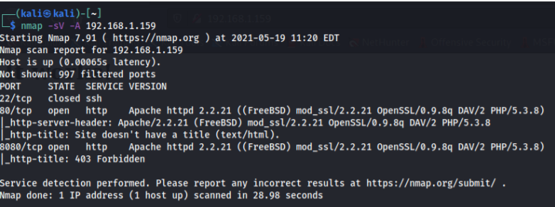

From this scan, we can see that port 80 and 8080 are open and port 8080 is forbidden.
When we check them out:

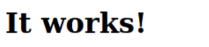
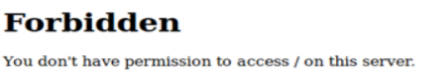

Which reveals that we don't have access on port 8080

## Directory Traversal

When we inspect the page on port 80:

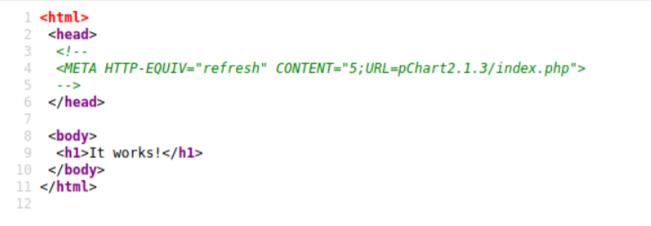

It shows a URL. When we navigate to it:

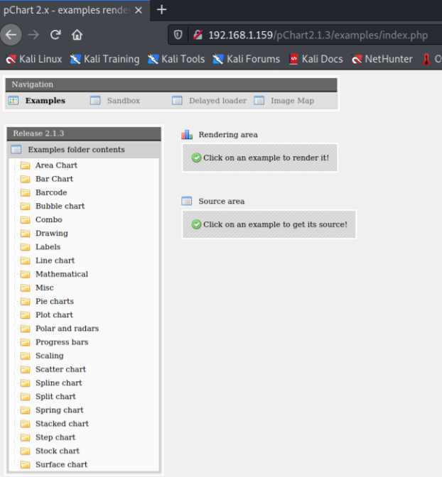

A pChart page opens up. When we google this **pChart 2.1.3** version, we can find that it has
multiple vulnerabilities. <br>
https://www.exploit-db.com/exploits/31173 <br>
And it also has a directory traversal vulnerability

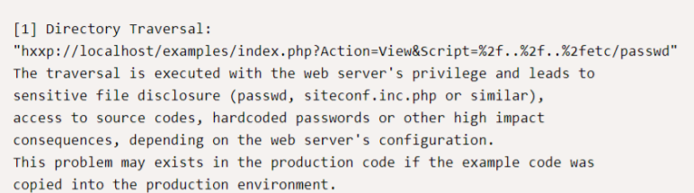

So when we try modifying the URL,

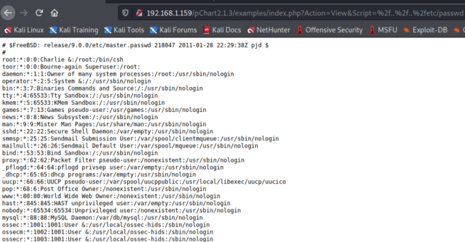

It worked. Now we try to access the Apache HTTP config file in which we may find some
information regarding the forbidden page on port 8080.
When we search about **Apache 2.2.21 under FreeBSD** which we found in the nmap scan, we
can find the directory in which the config file is located.

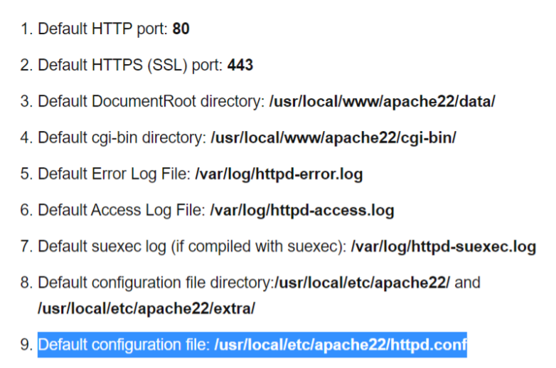

When we navigate to the directory,

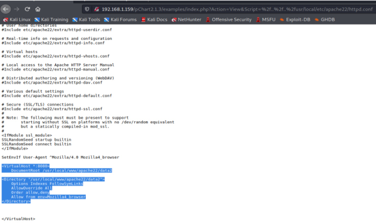

We get some information about the page at port 8080. <br>
The root directory for Port 8080 was located in **/usr/local/www/apache22/data2** and there is
an access-list which allowed only **Mozilla/4.0** browsers to connect to the site.
To bypass it, we have to navigate to **about:config** and add a string named
**general.useragent.override** and its value as **Mozilla/4.0 (X11; Linux x86_64; rv:10.0)
Gecko/20100101 Firefox/10.0**. This will bypass the access-list and now we will have access
to the forbidden page.

## Remote Code Execution

Now when we navigate to the page at port 8080,

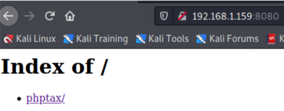

And if we follow the link:

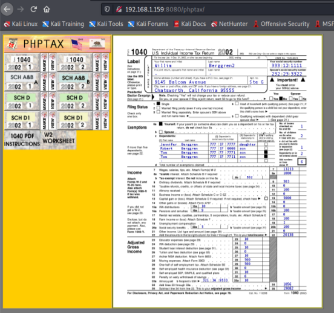

We get a tax return program called **PHPTAX**
When we google about this phptax, we can find a **Remote code execution** exploit in this
program.
https://www.rapid7.com/db/modules/exploit/multi/http/phptax_exec/ <br>
And this tells that we can use a module in **metasploit** to perform a remote code execution attack

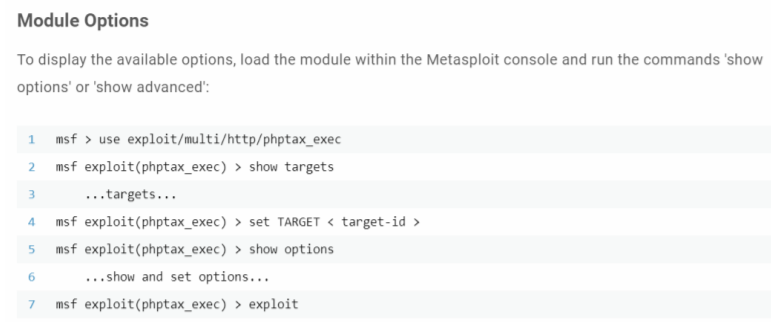

Now we can try to exploit using metasploit.
After setting RHOSTS and RPORT,

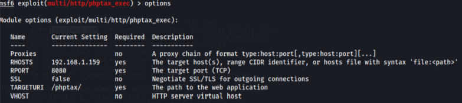

We can run the exploit now. 

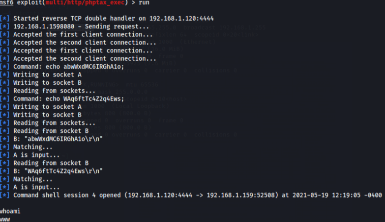

Now we have a shell active in the Kioptrix system, we can check the OS and Kernel versions

```bash
uname -ma
```

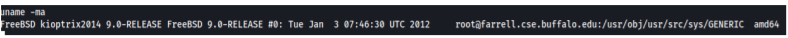

If we google about that **FreeBSD 9.0** version, we can find a local privilege escalation exploit
https://www.exploit-db.com/exploits/28718 .

And netcat and gcc was available in this shell. So we can copy the exploit through netcat
and run the exploit

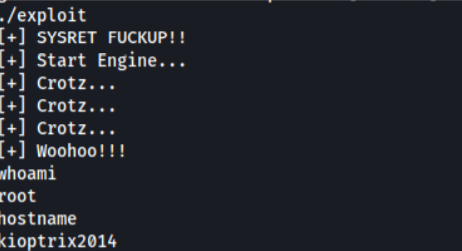

Finally, we got root access and completed the final level <3 <br>
