---
# pWnOS: 2.0 - Vulnhub VM Challenge

## Description
**Goal:** <br>
Get root... Win! <br>

**About**: <br>
pWnOS v2.0 is a Virutal Machine Image which hosts a server to pratice penetration testing. It will test your ability to exploit the server and contains multiple entry points to reach the goal (root). It was design to be used with WMWare Workstation 7.0, but can also be used with most other virtual machine software.

**Configuration & Setup:** <br>
Configure your attacking platform to be within the **10.10.10.0/24** network range. <br>

**Server's Network Settings:** <br>

**IP:** 10.10.10.100
<br>
**Netmask:** 255.255.255.0
<br>
**Gateway:** 10.10.10.15
<br>

## Finding the IP of the Target Machine

Here the static ip of the lab is already provided as 10.10.10.100 so we can proceed to run
some scans on this ip.

## Initial Scan 

First, [Nmap scanner](https://github.com/nmap/nmap) is used to find all the open ports and services running. 

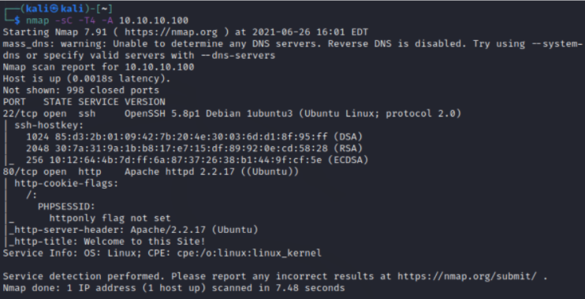

From this scan, we can see that port 22 and 80 are open. **SSH** service is running on port 22
and an **Apache** server is open on port 80. 
<br>

When we go to the webpage hosted on port 80

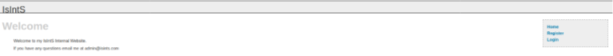

Now [Dirb](https://github.com/v0re/dirb) web content scanner is used to find some information about some hidden directories

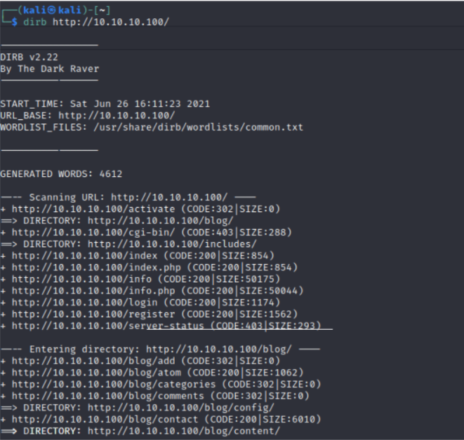
<br>

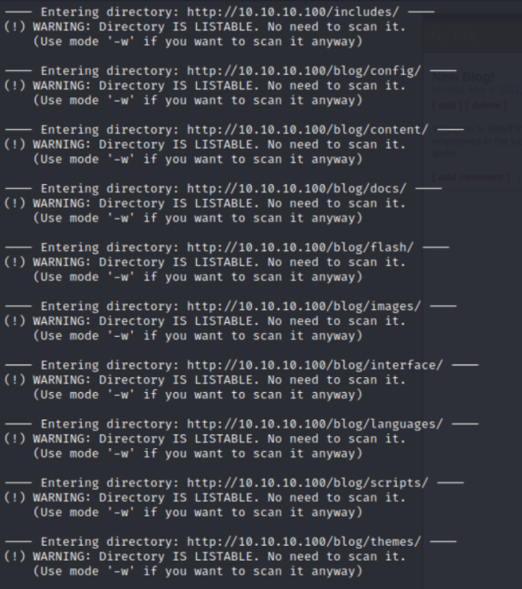

Here, we can find that there is a directory named **blog** and also some other directories.

When we navigate to the directory,

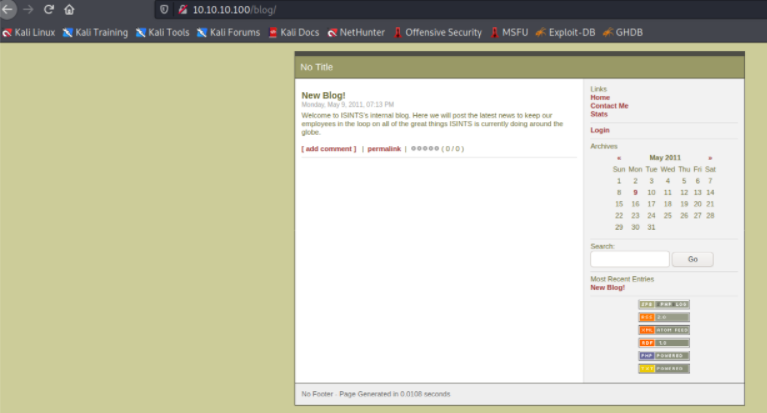

And when we check the page source


It shows that this website runs on [**Simple PHP Blog 0.4.0**](https://www.exploit-db.com/exploits/1191) 
<br>

When we search about that, we will be able to find about a **Perl** script

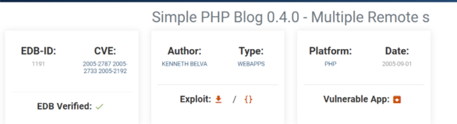

They have also mentioned the instructions for using the script

```bash
	Usage	: $0 [-h host] [-e exploit]
	
		-?      : this menu
		-h      : host
		-e	: exploit
			(1)	: Upload cmd.php in [site]/images/
			(2)	: Retreive Password file (hash)
			(3)	: Set New User Name and Password
				[NOTE - uppercase switches for exploits]
				-U	: user name
				-P	: password
			(4)	: Delete a System File
				-F	: Path and System File 

	Examples: $0 -h 127.0.0.1 -e 2
		  $0 -h 127.0.0.1 -e 3 -U l33t -P l33t
		  $0 -h 127.0.0.1 -e 4 -F ./index.php
		  $0 -h 127.0.0.1 -e 4 -F ../../../etc/passwd
		  $0 -h 127.0.0.1 -e 1
```

So we download this script and execute it using the command below to add a username and password of our choice

```bash
perl 1191.pl -h http://10.10.10.100/blog -e 3 -U agent47 -P agent47
```

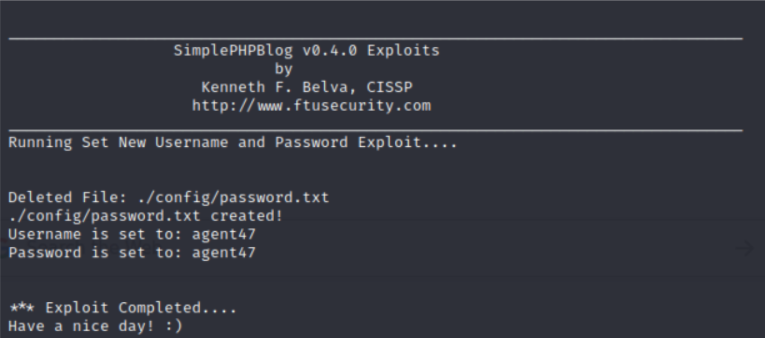

Now after adding the username and password, we can login to the blog with those credentials.

And when we login,

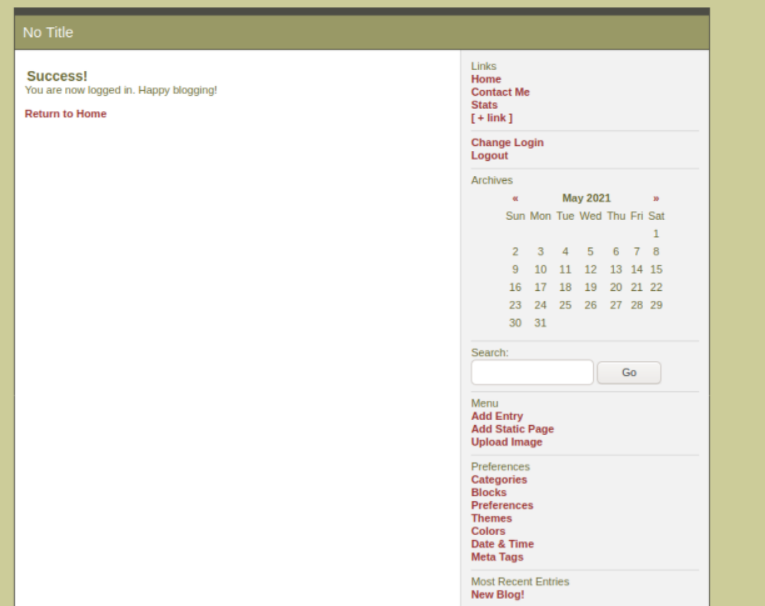

We can find that there is an update in the menu section. Here the **Upload Image** option is a bit
sketchy. So when we try clicking that,

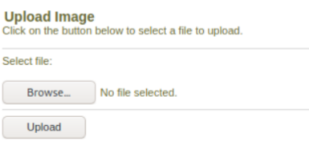

We were actually able to upload files. So here we can try to upload a reverse shell to proceed
further. Here, a [PHP reverse shell](http://pentestmonkey.net/tools/web-shells/php-reverse-shell) from Pentest Monkey is uploaded.

**Note:** Before uploading the reverse.php file, make sure to change the ip to the ip of the
attacking machine and port that you want to spawn the shell

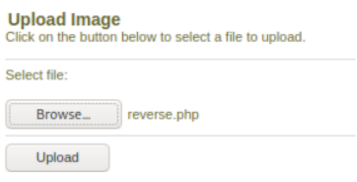

After uploading, we check the directory **blog/images** which we found in the initial **dirb** scan. 
When we navigate to the directory, we can see that the file **reverse.php** is actually uploaded and is ready to run.

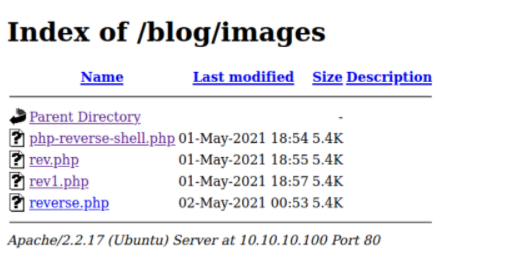

Now we can set up a **netcat** listener on our machine and open the **reverse.php** file to spawn a reverse shell
like the one below:

```bash
nc -lvnp 1234
```

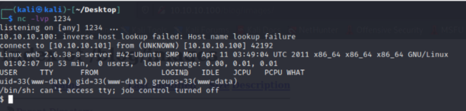

When we list the directory we can find a var folder and then when we list the contents in the
var directory,

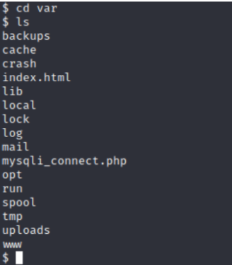

There was something odd in this directory. A **mysqli_connect.php** file was present in the var directory itself. It might be indicating something. 
So when we display the file **mysqli_connect.php**, we get a username and a password

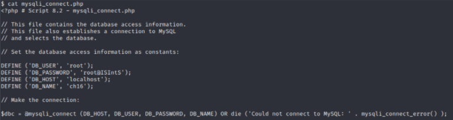

As there was an **SSH** service running in this machine, we try to login with these root credentials.

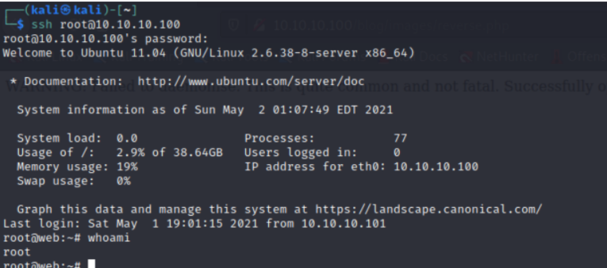

Finally, root access is acquired <3


